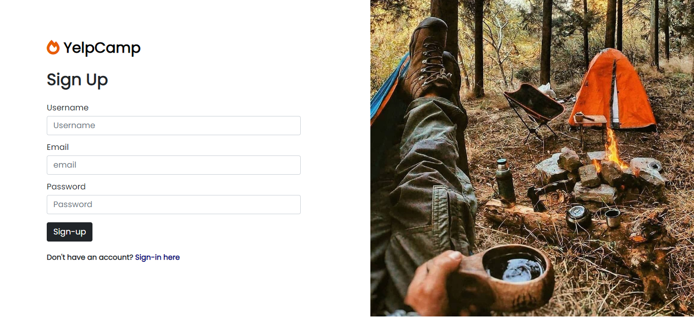
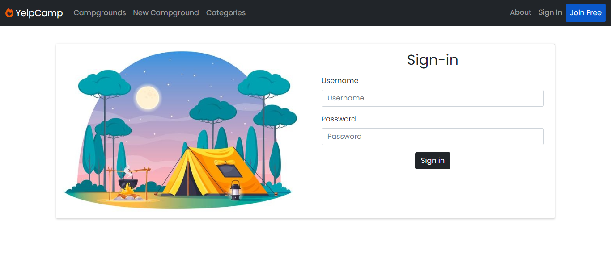
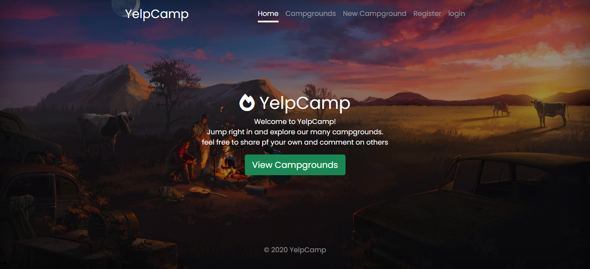
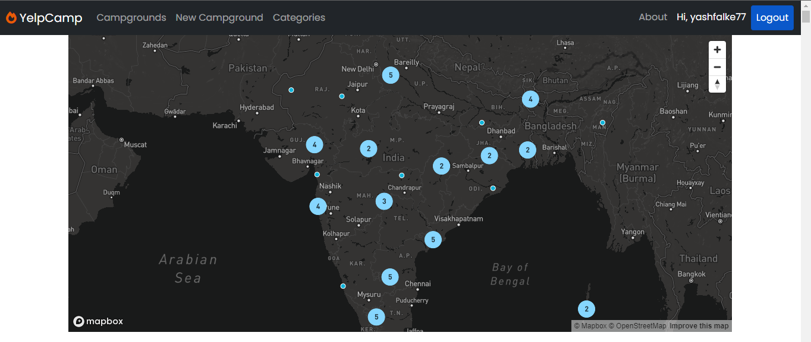
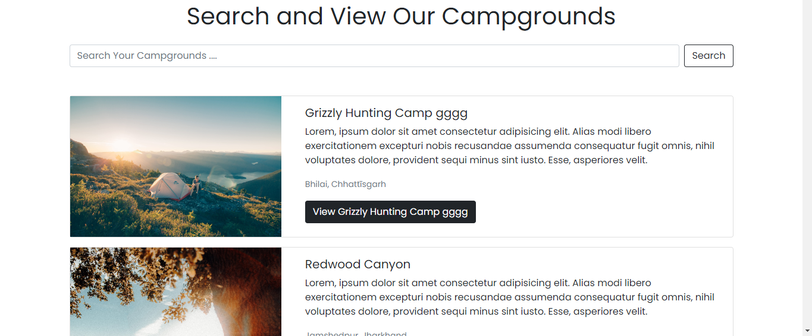
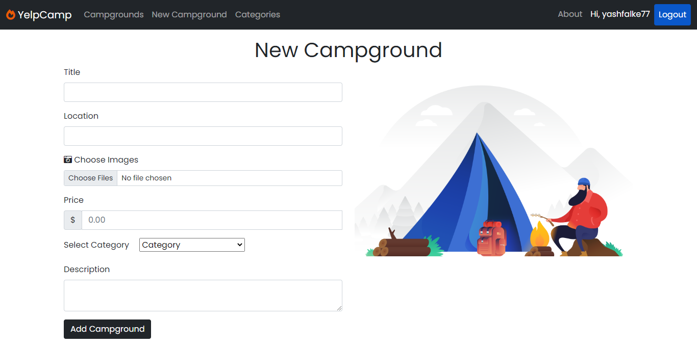
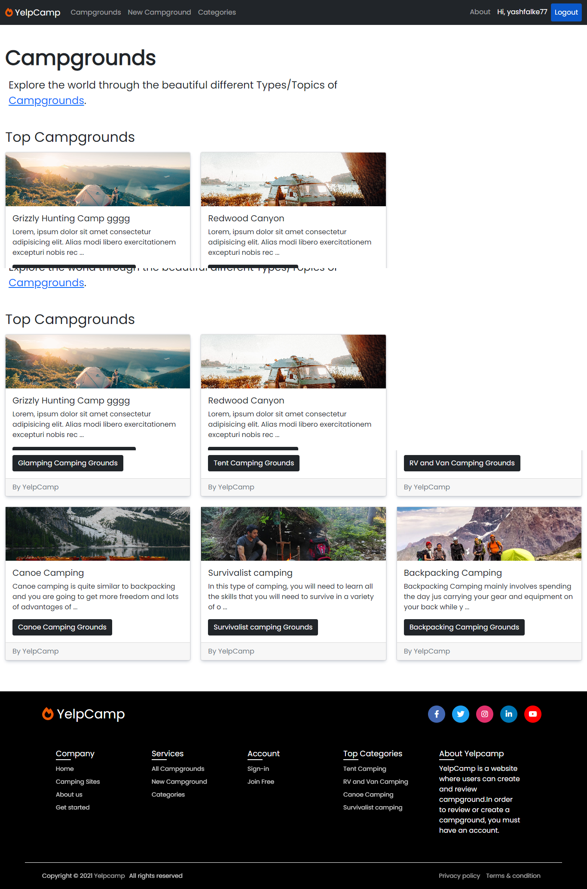

<div id="top"></div>

<br />
<div align="center">
  <p align="center">
    <b>YelpCamp Campgrounds</b>
    <br />
    <!-- <a href="https://arcane-retreat-14101.herokuapp.com/">View Demo</a> -->
    <!-- · -->
    <a href="https://github.com/yashfalke77/food-ordering-app/issues">Report Bug</a>
    ·
    <a href="https://github.com/yashfalke77/food-ordering-app/issues">Request Feature</a>
  </p>
</div>

<!-- ABOUT THE PROJECT -->

## About The Project

Yelp Camp is a web application that allows you to view campgrounds with a short description. Once you login or signup you can begin to create your own campgrounds that includes a title, image, address and short description. Explore the beautiful world through our website

### Project Images

#### Sign Up


#### Sign In


#### Home


#### All Campgrounds



#### New Campgrounds


#### About


<p align="right">(<a href="#top">back to top</a>)</p>

### Built With

This section should list any major frameworks/libraries used to bootstrap your project. Leave any add-ons/plugins for the acknowledgements section. Here are a few examples.

- [Express.js](https://expressjs.com/)
- [Nodejs](https://nodejs.org/en/)
- [EJS](https://ejs.co/)
- [MongoDB](https://www.mongodb.com/)
- 
<p align="right">(<a href="#top">back to top</a>)</p>

<!-- GETTING STARTED -->

## Getting Started

This is an example of how you may give instructions on setting up your project locally.
To get a local copy up and running follow these simple example steps.

### Prerequisites

This is an example of how to list things you need to use the software and how to install them.

- npm
  ```sh
  npm install npm@latest -g
  ```

### Installation

1. Clone the repo
   ```sh
   git clone https://github.com/yashfalke77/YelpCamp-Campgrounds
   ```
2. Install NPM packages
   ```sh
   npm install
   ```
3. Check the .env.example file and make your .env file

<p align="right">(<a href="#top">back to top</a>)</p>

<!-- CONTRIBUTING -->

## Contributing

Contributions are what make the open source community such an amazing place to learn, inspire, and create. Any contributions you make are **greatly appreciated**.

If you have a suggestion that would make this better, please fork the repo and create a pull request. You can also simply open an issue with the tag "enhancement".
Don't forget to give the project a star! Thanks again!

1. Fork the Project
2. Create your Feature Branch (`git checkout -b feature/AmazingFeature`)
3. Commit your Changes (`git commit -m 'Add some AmazingFeature'`)
4. Push to the Branch (`git push origin feature/AmazingFeature`)
5. Open a Pull Request

<p align="right">(<a href="#top">back to top</a>)</p>

<!-- LICENSE -->

## License

Distributed under the MIT License. See `LICENSE.txt` for more information.

<p align="right">(<a href="#top">back to top</a>)</p>

<!-- CONTACT -->

## Contact

Yash Falke - [@yashfalke77](https://www.instagram.com/yashfalke77/) - yashfalke77@gmail.com

Project Link: [YelpCamp Campgrounds](https://github.com/yashfalke77/YelpCamp-Campgrounds)

<p align="right">(<a href="#top">back to top</a>)</p>

<!-- ACKNOWLEDGMENTS -->

<p align="right">(<a href="#top">back to top</a>)</p>
